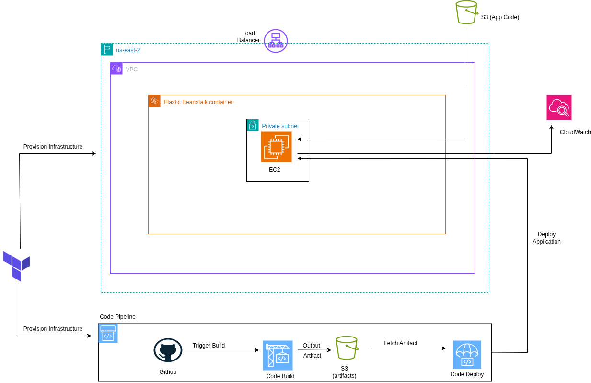

# Application Deployment on Bean Stalk via Code PipeLine

This repository uses **Terraform** to provision AWS infrastructure and deploy an **Node Js** on **Elastic Bean Stalk** via **Code PipeLine**

## 🚀 Project Overview

### Key Features

* Modularized Terraform structure (VPC & BeanStalk & Code Pipeline modules)
* Custom VPC with Public and Private subnets
* Publicly accessible Node application

## Architecture Diagram


## 🔐 AWS CLI Configuration

Ensure your CLI is configured with proper credentials:
```bash
aws configure
```
## ⚙️ Deployment Steps

```bash
# Step 1: Initialize Terraform
terraform init

# Step 2: Preview the execution plan
terraform plan

# Step 3: Apply and provision the infrastructure
terraform apply
```
## 📦 Provisioned Resources

* Modularized Terraform structure (VPC & BeanStalk & Code Pipeline modules)
* Custom VPC with Public and Private subnets
* Publicly accessible Node application

## 🌐 Access

After deployment, access your Node application using the Bean Stalk DNS.

## 🧹 Cleanup

To destroy all provisioned resources:

```bash
terraform destroy
```


